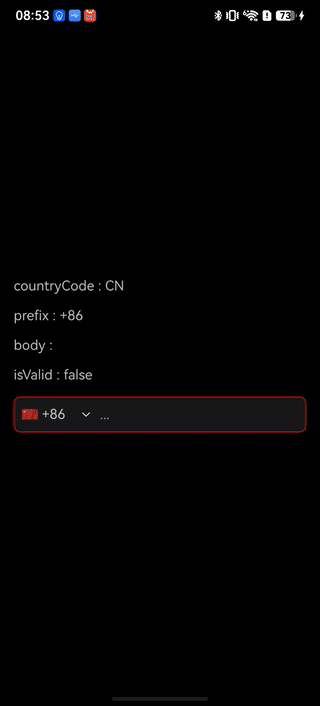

> **Note:** To access all shared projects, get information about environment setup, and view other guides, please visit [Explore-In-HMOS-Wearable Index](https://github.com/Explore-In-HMOS-Wearable/hmos-index).

# PhoneNumberInput

A HarmonyOS library providing a phone number input component with country code selection.

## Features

- Country code picker with search functionality
- Automatic phone number formatting based on country conventions
- Real-time phone number validation
- Support for 200+ countries with flags and dial codes
- Localization support for country names

## Installation

```bash
ohpm install @explore-in-hmos/phone_number_input
```

## Usage

```typescript
import { PhoneNumber, PhoneNumberInput } from '@explore-in-hmos/phone_number_input'

@Entry
@Component
struct Index {
  @State phoneNumber?: PhoneNumber = undefined

  build() {
    Column({ space: 16 }) {
      Text(`countryCode : ${this.phoneNumber?.countryCode}`)
      Text(`prefix : ${this.phoneNumber?.prefix}`)
      Text(`body : ${this.phoneNumber?.body}`)
      Text(`isValid : ${this.phoneNumber?.isValid}`)
      PhoneNumberInput({ phoneNumber: this.phoneNumber })
    }
    .height('100%')
    .width('100%')
    .padding(16)
    .justifyContent(FlexAlign.Center)
    .alignItems(HorizontalAlign.Start)
  }
}
```



## Components

### PhoneNumberInput

Main phone number input component with country code selector.

| Parameter          | Type                | Description                                                  |
|--------------------|---------------------|--------------------------------------------------------------|
| phoneNumber        | `@Link PhoneNumber` | Bound phone number state                                     |
| initialCountryCode | `string`            | Initial country code (ISO 3166-1 alpha-2),<br/>Default: 'TR' |

### PhoneNumber

State interface for phone number data.

```typescript
interface PhoneNumber {
    countryCode: string; // ISO country code (e.g., "TR", "US")
    prefix: string; // Dial prefix (e.g., "+90", "+1")
    body: string; // Phone number body
    isValid: boolean; // Validation result
}
```

## License

MIT
